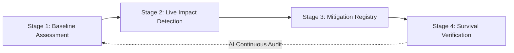
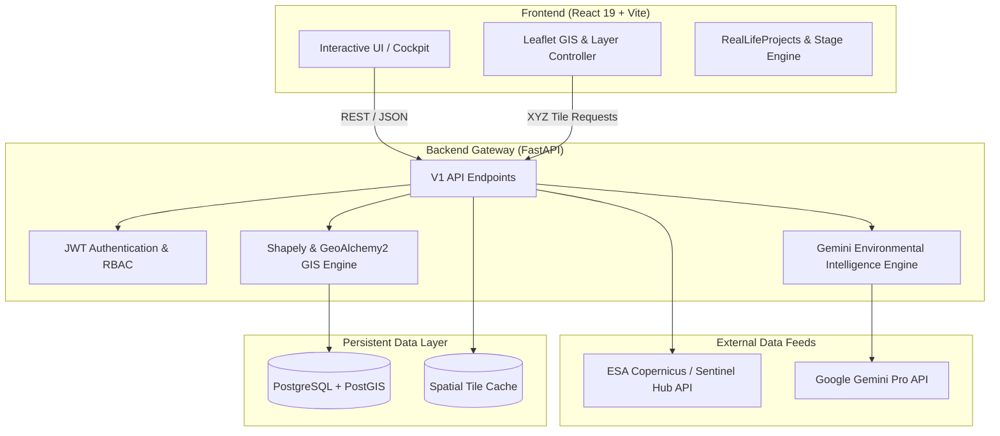

# 🌿 RITAM — Real-time Infrastructure & Terrestrial Analysis & Monitoring

<div align="center">


[](https://fastapi.tiangolo.com)
[](https://react.dev)
[](https://leafletjs.com)
[](https://dataspace.copernicus.eu/)
[](https://ai.google.dev/)
[](https://postgis.net/)
[](LICENSE)

**An evidence-driven, continuous Environmental Intelligence & Compliance Verification Platform.**  
*Transforming static environmental paperwork into dynamic, real-time remote-sensing intelligence.*

[Explore Live Demo](#quick-start) • [Architecture](#-system-architecture) • [Key Features](#-core-features) • [API Reference](#-api-endpoints) • [Screenshots](#-product-showcase--screenshots)

---

</div>

## 📖 Table of Contents

- [Overview](#-overview)
- [The Problem We Solve](#-the-problem-we-solve)
- [Core Features & 4-Stage Lifecycle](#-core-features--4-stage-lifecycle)
- [Product Showcase & Screenshots](#-product-showcase--screenshots)
- [System Architecture](#-system-architecture)
- [Tech Stack](#-tech-stack)
- [Project Structure](#-project-structure)
- [Quick Start Guide](#-quick-start-guide)
  - [Prerequisites](#prerequisites)
  - [Backend Setup (FastAPI)](#1-backend-setup-fastapi)
  - [Frontend Setup (React + Vite)](#2-frontend-setup-react--vite)
- [Configuration & Environment Variables](#-configuration--environment-variables)
- [API Endpoints](#-api-endpoints)
- [Roadmap & Future Horizons](#-roadmap)
- [License & Acknowledgments](#-license)

---

## 🌍 Overview

**RITAM** (*Real-time Infrastructure & Terrestrial Analysis & Monitoring*) is a next-generation environmental compliance platform designed to continuously monitor infrastructure and development projects (highways, railways, dams, industrial corridors) throughout their entire lifecycle.

Traditional environmental compliance relies on periodic, self-reported PDF documents and static audits. RITAM replaces this fragmented workflow with a **living, satellite-verified environmental ledger** that automatically tracks:

1. **What existed before construction** (*Historical Baseline*)
2. **What changed during construction** (*Deforestation, Earthworks, Canopy Loss*)
3. **What mitigation was promised** (*Compensatory Afforestation Commitments*)
4. **What actually survived on the ground** (*Long-Term Multi-Spectral Survival Verification*)

---

## 🎯 The Problem We Solve

| Traditional Compliance Audit | RITAM Continuous Intelligence |
| :--- | :--- |
| 📄 **Static PDF Reports** generated once every 6–12 months | 🛰️ **Continuous Satellite Monitoring** using Sentinel-2 L2A constellations |
| 🔍 **Delayed Detection** of unauthorized tree felling or boundary breaches | 🚨 **Real-Time Spatial Alerts** triggered on vegetation anomalies & encroachments |
| 📉 **Untracked Plantation Survival** (plantings often die unnoticed) | 🌱 **Multi-Year NDVI & TrueColor Verification** tracking sapling growth rates |
| 🗂️ **Siloed Evidence** scattered across photos, CAD files, and emails | 🔗 **Unified GIS Ledger** combining GeoJSON boundaries, drone data, and AI audits |

---

## ✨ Core Features & 4-Stage Lifecycle



### 🛰️ 1. Multi-Spectral Remote Sensing & Dynamic GIS
- **Sentinel-2 ESA & Sentinel Hub Integration**: Live high-resolution TrueColor RGB, Normalized Difference Vegetation Index (NDVI), Moisture Index, and False Color IR.
- **Dynamic Viewport Synchronization**: Instant zoom-adaptive tile loading (Zoom levels 3 to 18) with sub-second spatial tile rendering.
- **GeoJSON Boundary Overlay**: Polygon boundary inspection, buffer zones, and corridor alignment tracking.

### 🔬 2. Four-Stage Lifecycle Cockpit
- **Stage 1 — Baseline Assessment**: Pre-construction forest density, canopy health, biodiversity indices, and pre-clearing ecological metrics.
- **Stage 2 — Impact & Change Detection**: Active construction monitoring, deforestation alerts, earthwork progression, and boundary violation flags.
- **Stage 3 — Compensatory Mitigation**: Registry of compensatory afforestation sites, species allocation, budget tracking, and planting schedules.
- **Stage 4 — Survival & Growth Audit**: Multi-year satellite survival verification, canopy density growth curves, and regulatory sign-off metrics.

### 🤖 3. AI-Powered Environmental Auditor (Gemini Pro)
- **Automated Anomaly Explanations**: Generates natural language impact summaries from raw NDVI telemetry and spatial metrics.
- **Regulatory Compliance Scoring**: Evaluates compliance percentage against state and central forest conservation guidelines.
- **Smart Remediation Recommendations**: Suggests targeted replanting or irrigation interventions for deteriorating parcels.

---

## 📸 Product Showcase & Screenshots

> *Replace the placeholder paths below with your actual application screenshots in `frontend/src/assets/screenshots/`.*

<div align="center">

### 1. Global Environmental Cockpit
*High-level dashboard showcasing national project portfolios, compliance health scores, and critical alerts.*

```
+-----------------------------------------------------------------------------------+
|  [PROJECT HUB] Bharatmala Expressway Package 4                 [COMPLIANCE: 87%]  |
|  +--------------------------------------+  +-----------------------------------+  |
|  |  [SATELLITE VIEWPORT - TRUECOLOR]    |  |  [STAGE 2: ACTIVE IMPACT METRICS] |  |
|  |                                      |  |  • Forest Canopy Cleared: 14.2 ha |  |
|  |      [Project GeoJSON Corridor]      |  |  • Unauthorized Clearing: 0.0 ha  |  |
|  |                                      |  |  • Water Turbidity Index: Normal  |  |
|  +--------------------------------------+  +-----------------------------------+  |
|  [STAGE 1: BASELINE]  [STAGE 2: IMPACT]  [STAGE 3: MITIGATION]  [STAGE 4: SURVIVAL]|
+-----------------------------------------------------------------------------------+
```


*Figure 1: RITAM Main Command Cockpit with synchronized GIS map and stage-by-stage compliance inspector.*

---

### 2. Multi-Spectral Satellite Analysis (NDVI vs TrueColor)
*Side-by-side vegetation health verification and spectral anomaly detection.*


*Figure 2: Sub-pixel NDVI vegetation index calculation comparing baseline vs active construction periods.*

---

### 3. AI Intelligence & Compliance Audit
*Gemini-driven automated compliance scoring, risk assessment, and actionable mitigation directives.*


*Figure 3: Automated environmental analysis with AI-generated risk scores and replanting schedules.*

</div>

---

## 🏗️ System Architecture



---

## 💻 Tech Stack

### Frontend
- **Framework**: [React 19](https://react.dev/) + [Vite 8](https://vitejs.dev/)
- **Mapping & GIS**: [Leaflet 1.9](https://leafletjs.com/) + Custom Tile Providers
- **Icons & Visuals**: [Lucide React](https://lucide.dev/)
- **Styling**: Pure Modular CSS3 (Zero heavy runtime overhead, tailored glassmorphism design system)

### Backend
- **Framework**: [FastAPI 0.115+](https://fastapi.tiangolo.com/)
- **Server Engine**: [Uvicorn](https://www.uvicorn.org/) (Async ASGI)
- **Spatial Geometry**: [Shapely](https://shapely.readthedocs.io/), [GeoAlchemy2](https://geoalchemy-2.readthedocs.io/)
- **Satellite Engine**: [SentinelHub Python SDK](https://sentinelhub-py.readthedocs.io/)
- **AI / LLM**: [Google Gemini 1.5 / 2.0 Pro](https://ai.google.dev/)
- **ORM & Migrations**: [SQLAlchemy 2.0](https://www.sqlalchemy.org/) + [Alembic](https://alembic.sqlalchemy.org/)
- **Database**: PostgreSQL 16 with PostGIS extension

---

## 📁 Project Structure

```
ritam/
├── docs/                               # Product & Architecture Specifications
│   ├── architecture.md                 # Full technical architecture document
│   ├── prd.md                          # Product requirements document
│   ├── userflow.md                     # User journeys & persona flows
│   └── screenshots/                    # UI Screenshots for documentation
│
├── backend/                            # FastAPI Backend Service
│   ├── app/
│   │   ├── api/v1/                     # API Route Controllers (Projects, Satellites, AI)
│   │   │   ├── endpoints/
│   │   │   │   ├── ai.py               # Gemini AI analysis endpoints
│   │   │   │   ├── auth.py             # User authentication
│   │   │   │   ├── projects.py         # Infrastructure project CRUD
│   │   │   │   └── satellite.py        # Sentinel-2 tile streaming
│   │   │   └── api.py                  # Master router
│   │   ├── core/                       # Security, config & database connections
│   │   ├── models/                     # SQLAlchemy PostGIS spatial models
│   │   ├── schemas/                    # Pydantic validation schemas
│   │   ├── services/                   # Business logic (Gemini, SentinelHub, GIS)
│   │   └── main.py                     # FastAPI Application entry point
│   ├── alembic/                        # Database migration scripts
│   └── requirements.txt                # Python dependencies
│
├── frontend/                           # React 19 Frontend Application
│   ├── src/
│   │   ├── assets/                     # Logos, illustrations, and banners
│   │   ├── components/
│   │   │   ├── cockpit/                # Stage 1-4 Lifecycle inspectors
│   │   │   │   ├── Stage1Baseline.jsx
│   │   │   │   ├── Stage2Impact.jsx
│   │   │   │   ├── Stage3Mitigation.jsx
│   │   │   │   └── Stage4Verification.jsx
│   │   │   ├── LoginView.jsx           # User authentication interface
│   │   │   ├── ProjectSelectHub.jsx    # Project catalog and filters
│   │   │   ├── SpatialMap.jsx          # Interactive Leaflet satellite map
│   │   │   └── TopCommandBar.jsx       # Header controls & AI trigger
│   │   ├── data/                       # Real-life projects & mock telemetry
│   │   ├── App.jsx                     # Root application container
│   │   └── index.css                   # High-performance glassmorphism theme
│   ├── package.json                    # Node dependencies & scripts
│   └── vite.config.js                  # Vite bundler configuration
│
└── README.md                           # Master Documentation
```

---

## 🚀 Quick Start Guide

### Prerequisites
- **Node.js** >= 18.x
- **Python** >= 3.10
- **PostgreSQL** >= 15 with **PostGIS** extension (optional for pure mock mode)
- **Git**

---

### 1. Backend Setup (FastAPI)

```bash
# Navigate to backend directory
cd RITAM/backend

# Create and activate virtual environment
python -m venv venv

# Windows:
.\venv\Scripts\activate
# Linux/macOS:
# source venv/bin/activate

# Install dependencies
pip install -r requirements.txt

# Configure environment variables
cp .env.example .env
# Edit .env with your Sentinel Hub and Gemini API keys

# Run the FastAPI server
uvicorn app.main:app --reload --host 0.0.0.0 --port 8000
```

Backend Swagger UI will be available at: **`http://localhost:8000/docs`**

---

### 2. Frontend Setup (React + Vite)

```bash
# Open a new terminal and navigate to frontend directory
cd RITAM/frontend

# Install node dependencies
npm install

# Start development server
npm run dev
```

Frontend application will be running at: **`http://localhost:5173`**

---

## ⚙️ Configuration & Environment Variables

Create a `.env` file in `RITAM/backend/.env` with the following variables:

```env
# Application Settings
PROJECT_NAME="RITAM Environmental Intelligence"
API_V1_STR="/api/v1"
SECRET_KEY="your-secure-random-secret-key"
ACCESS_TOKEN_EXPIRE_MINUTES=1440

# Database Configuration (PostgreSQL + PostGIS)
POSTGRES_SERVER=localhost
POSTGRES_USER=postgres
POSTGRES_PASSWORD=postgres
POSTGRES_DB=ritam_db
POSTGRES_PORT=5432

# Google Gemini AI Integration
GEMINI_API_KEY="AIzaSyYourGeminiApiKeyHere"

# Sentinel Hub / Copernicus Earth Observation (Optional for live tiles)
SENTINEL_HUB_INSTANCE_ID="your-sentinel-hub-instance-id"
SENTINEL_HUB_CLIENT_ID="your-sentinel-hub-client-id"
SENTINEL_HUB_CLIENT_SECRET="your-sentinel-hub-client-secret"
```

---

## 📡 API Endpoints

### 🔐 Authentication & Users
| Method | Endpoint | Description |
| :--- | :--- | :--- |
| `POST` | `/api/v1/auth/login` | Authenticate user and receive JWT bearer token |
| `GET` | `/api/v1/auth/me` | Fetch current authenticated user profile |

### 🏗️ Projects & GIS Boundaries
| Method | Endpoint | Description |
| :--- | :--- | :--- |
| `GET` | `/api/v1/projects` | List all infrastructure projects with spatial status |
| `POST` | `/api/v1/projects` | Register new project with GeoJSON boundary |
| `GET` | `/api/v1/projects/{id}` | Fetch detailed project lifecycle metrics & stages |

### 🛰️ Satellite & Earth Observation
| Method | Endpoint | Description |
| :--- | :--- | :--- |
| `GET` | `/api/v1/satellite/tiles/{z}/{x}/{y}` | Stream Sentinel-2 multi-spectral XYZ map tiles |
| `GET` | `/api/v1/satellite/ndvi-timeseries` | Fetch historical NDVI vegetation index graph |
| `POST` | `/api/v1/satellite/change-detection` | Compute canopy loss between two historical dates |

### 🤖 AI Environmental Intelligence
| Method | Endpoint | Description |
| :--- | :--- | :--- |
| `POST` | `/api/v1/ai/audit` | Run comprehensive Gemini-powered compliance audit |
| `POST` | `/api/v1/ai/recommendations` | Generate customized plantation survival directives |

---

## 🗺️ Roadmap

- [x] 4-Stage Project Lifecycle Engine (Baseline $\to$ Impact $\to$ Mitigation $\to$ Survival)
- [x] Interactive Leaflet GIS mapping with live Sentinel-2 TrueColor tiles
- [x] Google Gemini AI automated compliance analysis
- [x] Real-world infrastructure project datasets (India Focus)
- [ ] Drone photogrammetry orthomosaic upload & sub-centimeter point cloud analysis
- [ ] Automated drone flight path generation for targeted sapling survival inspection
- [ ] Integration with national environmental clearinghouse portals (PARIVESH)
- [ ] Decentralized immutable audit log on Hyperledger / Ethereum for regulatory transparency

---

## 📄 License

Distributed under the **MIT License**. See `LICENSE` for more information.

---

<div align="center">

**Built with precision for sustainable infrastructure development.**  
*RITAM — Guarding Earth from Orbit to Root.*

</div>
